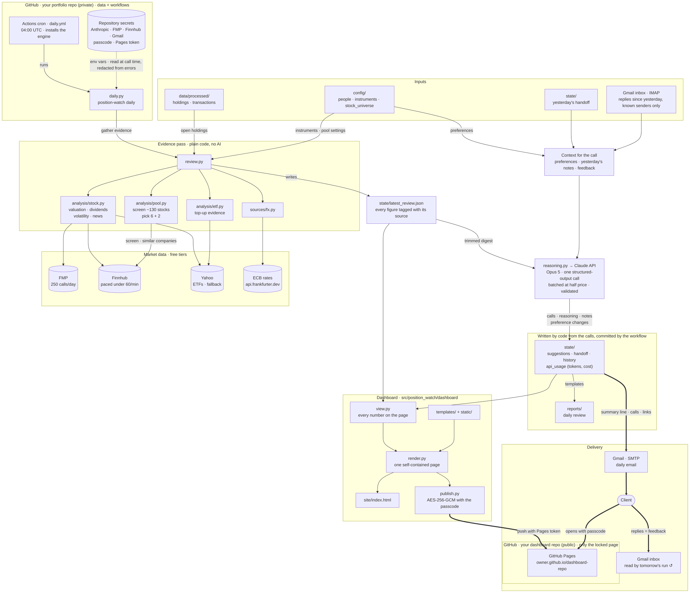

# Architecture

How a day of Position Watch works end to end. Each portfolio has its own private repository (created with `position-watch init`) holding its data and two workflows; the engine — this repository — is installed by those workflows. The daily workflow runs `position-watch daily`: plain code does every step, and a single Claude Opus 5 call turns the evidence into one call per holding. Results go out by email and as an encrypted dashboard; feedback comes back through Gmail the next morning, and lasting preferences it states are written back to `config/people.json`. The monthly workflow (not drawn) runs `position-watch monthly`: the month's calls and a review of the portfolio as a whole, from the same files and one more Claude call.

Line styles: **thick** arrows reach the client, **dotted** arrows carry secrets (never printed; redacted from any error text), plain arrows are internal calls and file writes.

