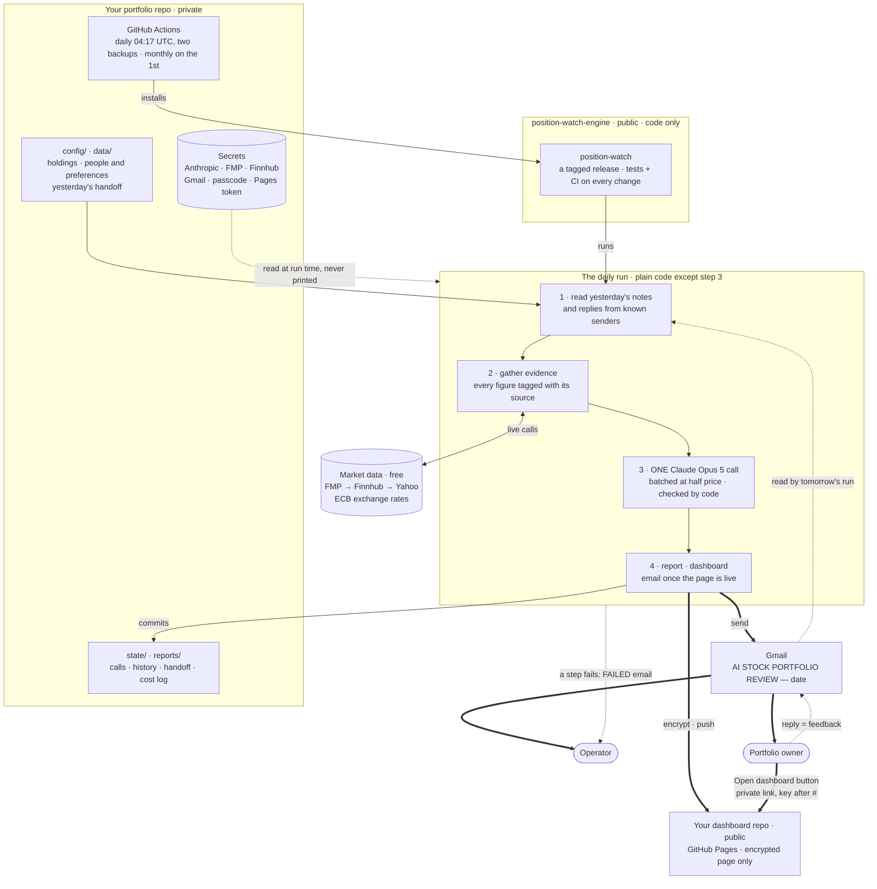
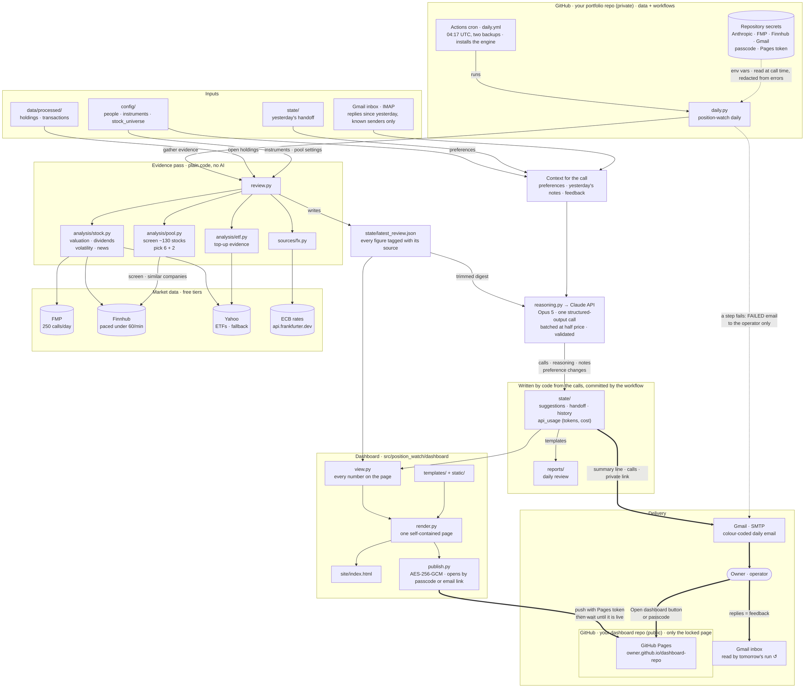
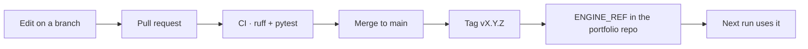

# Architecture

How Position Watch works end to end. Each portfolio has its own private repository (created with `position-watch init`) holding its data and two workflows; the engine — this repository — is installed by those workflows at a pinned release (`ENGINE_REF`) or `main`. Plain code does every step; a single Claude Opus 5 call a day turns the evidence into one call per holding. Results go out as a colour-coded email and an encrypted dashboard; replies come back through Gmail the next morning, and lasting preferences they state are written back to `config/people.json`.

## At a glance

Thick arrows reach people; dotted arrows carry secrets, feedback or the failure alert.

The operator and the owner can be the same person. The monthly workflow (not drawn) runs `position-watch monthly`: the month's calls and a review of the portfolio as a whole, from the same files and one more Claude call, emailed on the 1st.

## The daily run in detail

Line styles: **thick** arrows reach people, **dotted** arrows carry secrets (never printed; redacted from any error text) or the failure alert, plain arrows are internal calls and file writes.

## Shipping a change

Portfolio repos that don't set `ENGINE_REF` install `main`, which is why `main` must always run.
